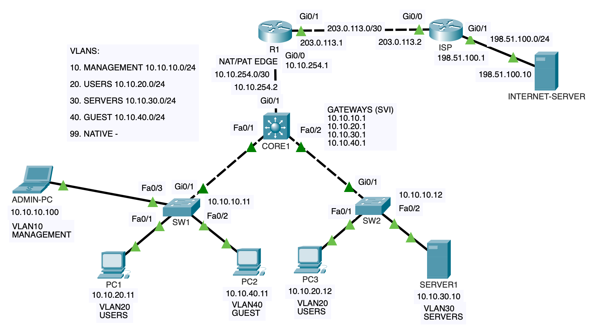

# Enterprise VLAN Segmentation & Inter-VLAN Routing

A Cisco Packet Tracer enterprise network project implementing VLAN segmentation, Layer 3 switching, secure network management, access-control policies, static routing, and NAT/PAT Internet connectivity.

The network separates **Management, Users, Servers, and Guest traffic** while providing controlled communication between network segments and simulated Internet access through an edge router.

---

## Network Topology



### Architecture

```text
                         INTERNET-SERVER
                         198.51.100.10
                               |
                              ISP
                               |
                       203.0.113.0/30
                               |
                              R1
                        NAT/PAT Gateway
                               |
                        10.10.254.0/30
                               |
                             CORE1
                         Layer 3 Switch
                         /             \
                      trunk           trunk
                       /                 \
                     SW1                 SW2
                  /   |   \             /   \
               PC1   PC2  ADMIN       PC3  SERVER1
```

---

## Project Objectives

The network was designed to demonstrate:

- VLAN-based network segmentation
- IEEE 802.1Q trunking
- Inter-VLAN routing using switched virtual interfaces (SVIs)
- Dedicated management VLAN
- SSH-based device management
- Management-plane access restrictions
- Guest network isolation using extended ACLs
- Static routing between enterprise and edge devices
- NAT/PAT for Internet connectivity
- Spanning Tree Protocol verification
- Structured network verification and troubleshooting

---

## VLAN Design

| VLAN | Name | Network | Default Gateway | Purpose |
|---|---|---|---|---|
| 10 | MANAGEMENT | 10.10.10.0/24 | 10.10.10.1 | Network management |
| 20 | USERS | 10.10.20.0/24 | 10.10.20.1 | Corporate users |
| 30 | SERVERS | 10.10.30.0/24 | 10.10.30.1 | Internal servers |
| 40 | GUEST | 10.10.40.0/24 | 10.10.40.1 | Guest clients |
| 99 | NATIVE | — | — | Native VLAN for trunk links |

CORE1 performs Layer 3 routing between the VLANs.

---

## Device Addressing

| Device | Interface / VLAN | IP Address | Role |
|---|---|---|---|
| CORE1 | VLAN10 | 10.10.10.1/24 | Management gateway |
| CORE1 | VLAN20 | 10.10.20.1/24 | Users gateway |
| CORE1 | VLAN30 | 10.10.30.1/24 | Servers gateway |
| CORE1 | VLAN40 | 10.10.40.1/24 | Guest gateway |
| CORE1 | Gi0/1 | 10.10.254.2/30 | Routed uplink to R1 |
| SW1 | VLAN10 | 10.10.10.11/24 | Switch management |
| SW2 | VLAN10 | 10.10.10.12/24 | Switch management |
| R1 | Gi0/0 | 10.10.254.1/30 | Enterprise-facing interface |
| R1 | Gi0/1 | 203.0.113.1/30 | ISP-facing interface |
| ISP | Gi0/0 | 203.0.113.2/30 | Link to R1 |
| ISP | Gi0/1 | 198.51.100.1/24 | Simulated public network |

---

## Endpoint Addressing

| Endpoint | VLAN | IP Address | Default Gateway |
|---|---|---|---|
| ADMIN-PC | 10 | 10.10.10.100/24 | 10.10.10.1 |
| PC1 | 20 | 10.10.20.11/24 | 10.10.20.1 |
| PC3 | 20 | 10.10.20.12/24 | 10.10.20.1 |
| SERVER1 | 30 | 10.10.30.10/24 | 10.10.30.1 |
| PC2 | 40 | 10.10.40.11/24 | 10.10.40.1 |
| INTERNET-SERVER | Public | 198.51.100.10/24 | 198.51.100.1 |

---

## Layer 2 Design

CORE1 connects to SW1 and SW2 using IEEE 802.1Q trunks.

```text
CORE1 Fa0/1 ↔ SW1 Gi0/1
CORE1 Fa0/2 ↔ SW2 Gi0/1
```

The trunks carry:

```text
VLANs 10,20,30,40,99
```

VLAN 99 is configured as the native VLAN.

Access ports use PortFast for end-device connectivity.

---

## Inter-VLAN Routing

CORE1 operates as the Layer 3 gateway for all internal VLANs using SVIs and IP routing.

```cisco
ip routing
```

Traffic between the Management, Users, Servers, and Guest networks is therefore routed at the core switch.

Security policies are applied at the Layer 3 boundary to control communication between network segments.

---

## Security Design

### Secure Management

SSH version 2 is used for remote administration.

Management access to the network infrastructure is restricted to:

```text
10.10.10.0/24
```

using the `SSH-MANAGEMENT` ACL.

This prevents hosts in user or guest networks from establishing SSH management sessions to network devices.

### Guest Isolation

An extended ACL named:

```text
GUEST-ISOLATION
```

is applied inbound to VLAN40.

Guest clients are prevented from accessing:

```text
10.10.10.0/24   MANAGEMENT
10.10.20.0/24   USERS
10.10.30.0/24   SERVERS
```

while retaining access to external networks.

This creates the following policy:

```text
GUEST → MANAGEMENT     DENY
GUEST → USERS          DENY
GUEST → SERVERS        DENY
GUEST → INTERNET       PERMIT
```

---

## Routing Design

CORE1 uses a default route toward the enterprise edge router:

```text
0.0.0.0/0 → 10.10.254.1
```

R1 uses a summarized route for the internal enterprise networks:

```text
10.10.0.0/16 → 10.10.254.2
```

R1 also uses a default route toward the simulated ISP:

```text
0.0.0.0/0 → 203.0.113.2
```

The ISP router contains a return route toward the enterprise network.

---

## NAT/PAT

R1 acts as the enterprise Internet edge and performs Port Address Translation.

Internal addressing:

```text
10.10.0.0/16
```

is translated using the ISP-facing R1 address:

```text
203.0.113.1
```

PAT allows multiple internal hosts to access the simulated Internet network using a single outside IPv4 address.

---

## Verification

The network was validated using Cisco IOS verification commands and end-to-end connectivity tests.

Examples include:

```cisco
show vlan brief
show interfaces trunk
show spanning-tree
show ip interface brief
show ip route
show access-lists
show ssh
show ip nat translations
show ip nat statistics
```

Successful tests include:

- Same-VLAN connectivity across multiple access switches
- Inter-VLAN routing
- Users-to-server connectivity
- SSH management from VLAN10
- SSH denial from non-management VLANs
- Guest isolation from internal networks
- Guest Internet connectivity
- User Internet connectivity
- NAT/PAT translation

Detailed results are available in:

[Verification & Validation](verification/verification.md)

---

## Troubleshooting

During implementation, several Layer 2 conditions were investigated, including:

- Temporary native VLAN mismatch during trunk configuration
- Unexpected STP/trunk verification output
- STP path cost behavior on a GigabitEthernet-to-FastEthernet link

Rather than making unnecessary configuration changes, operational state was validated using additional IOS commands and end-to-end testing.

Detailed troubleshooting notes:

[Troubleshooting Notes](troubleshooting/troubleshooting.md)

---

## Device Configurations

Sanitized device configurations are available here:

- [CORE1](configs/CORE1.txt)
- [SW1](configs/SW1.txt)
- [SW2](configs/SW2.txt)
- [R1](configs/R1.txt)
- [ISP](configs/ISP.txt)

Credentials and password hashes have intentionally been removed from the public configurations.

---

## Packet Tracer Lab

The complete Cisco Packet Tracer topology is included in this repository:

[Download Packet Tracer Lab](enterprise-vlan-inter-vlan-routing.pkt)

The `.pkt` file contains the complete working topology for further inspection and testing.

---

## Technologies Demonstrated

**Switching**
- VLANs
- Access ports
- IEEE 802.1Q trunking
- Native VLAN
- STP/PVST
- PortFast

**Routing**
- Layer 3 switching
- SVIs
- Inter-VLAN routing
- Routed switch ports
- Static routing
- Default routing
- Route summarization

**Security**
- SSHv2
- Management VLAN
- Standard ACLs
- Extended ACLs
- Management-plane access restriction
- Guest network isolation

**Network Edge**
- NAT
- PAT
- Private/public IPv4 addressing
- Simulated ISP connectivity

**Operations**
- Connectivity testing
- IOS verification commands
- Layer 2 troubleshooting
- Routing verification
- NAT verification

---

## Skills Demonstrated

This project demonstrates practical ability to design, implement, secure, verify, and troubleshoot a small enterprise network using Cisco IOS technologies.

The focus is not only on device configuration, but also on **network segmentation, traffic policy, secure management, routing behavior, validation, and structured technical documentation**.
